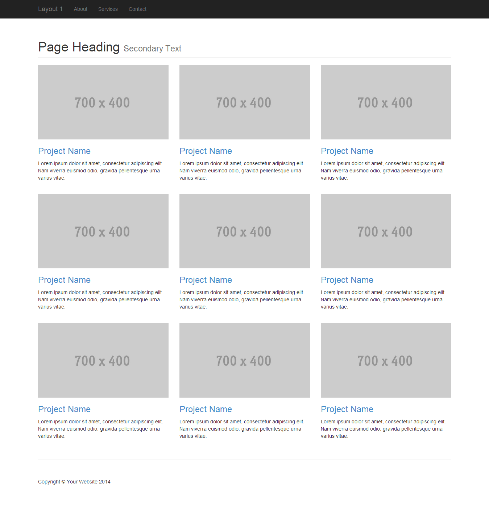
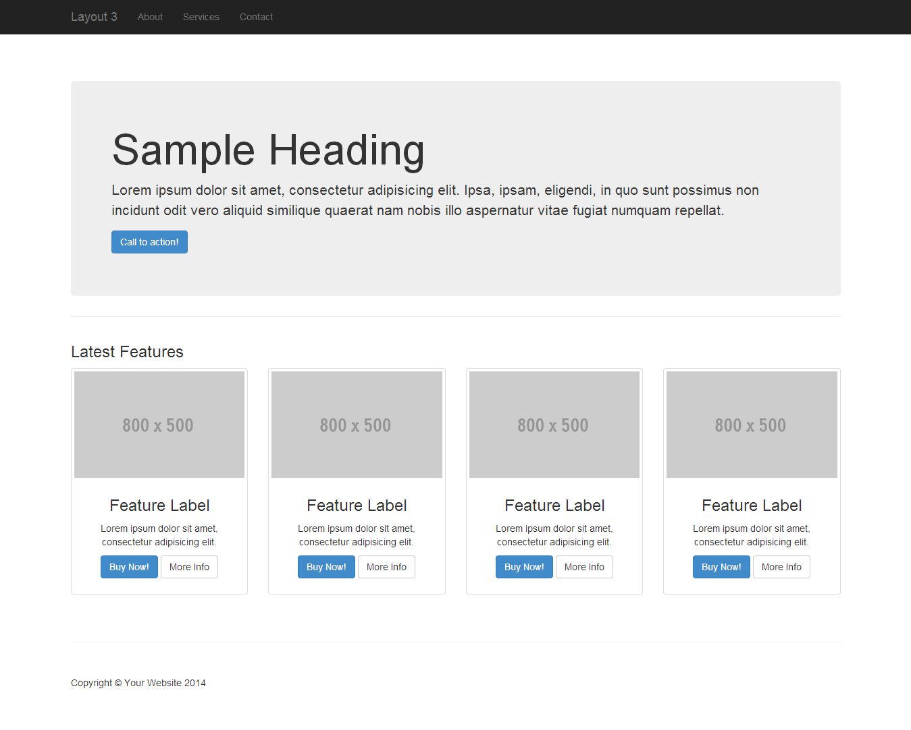
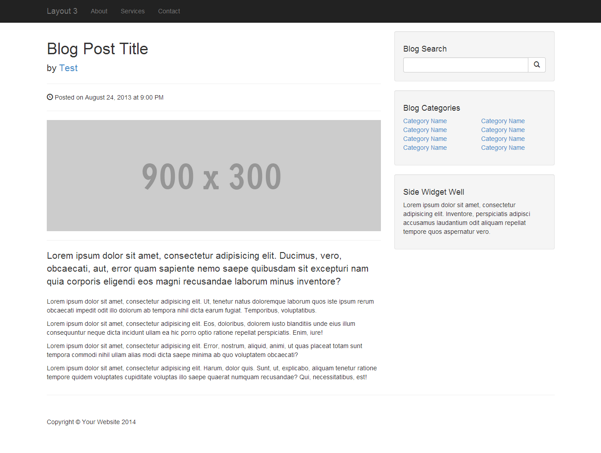

# HTML and CSS Templates

This repository contains three HTML and CSS templates created on 26/03/2024.

## Templates

### Template 1: 

- **Preview:**
- 

### Template 2: [Template Name 2]

- **Preview:**
- 

### Template 3: [Template Name 3]

- **Preview:**
- 

## Usage

Each template is self-contained within its own directory. To use a template:

1. Clone or download this repository.
2. Navigate to the directory of the desired template.
3. Open the `index.html` file in a web browser to view the template.
